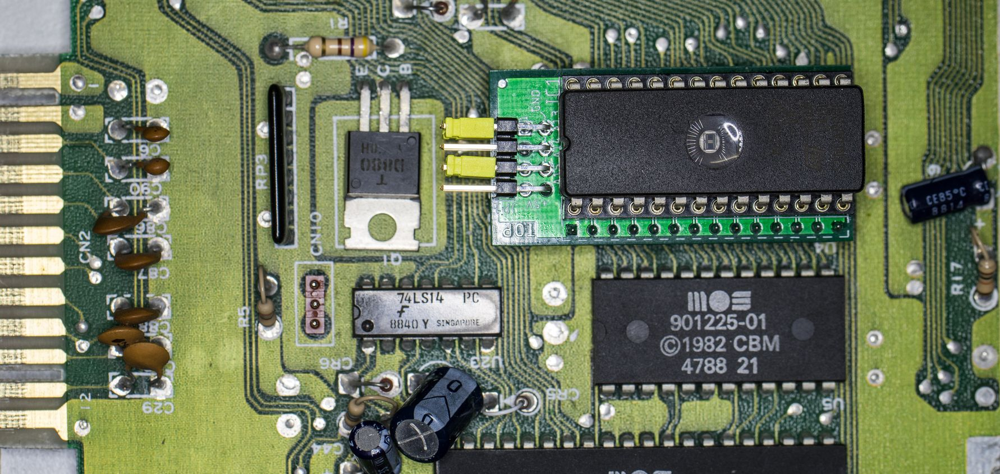

# C64 Kernel Switch    [![Badge License]][License]    [![Badge Price]][Price]

*An Adapter For **[ASSY250469]**, The 'Short Board'.*

 
 

Since the **BASIC** is stored in the same **ROM**,  
some circuit is required that allows for stable  
access to **BASIC**, while the Kernel is selected.

The kernel selection can be configured with  
either some jumpers, a switch or even using  
a micro controller.

*For this purpose, `+5V` are*  
*provided on the pin header.*

 
 

## Inspiration

This development was inspired by **Adrian Black's** YouTube video:  
    *[How - To: C64 Arduino based Restore Key / Four Kernal Switcher / Hard Reset][Video]*

 
 

# Revision 2

This revision provides an optional pin  
header with the address bit `A5` + `A8`  
for stereo **SID** applications.

 

<!----------------------------------------------------------------------------->

[ASSY250469]: https://support.retrorewind.ca/commodore/c64/assy-250469
[Video]: https://youtu.be/GPq5xnJRw2w

[License]: #
[Price]: Revisions/0/Excel '1. Calculation From BOM Of Rev. 0&#10;2. Component Prices May Have Changed&#10;3. Shipping fees not included'

<!---------------------------------{ Badges }---------------------------------->

[Badge License]: https://img.shields.io/badge/License-GPL_3-blue.svg?style=for-the-badge
[Badge Price]: https://img.shields.io/badge/Estimated_Price-4.88€-37a779?style=for-the-badge